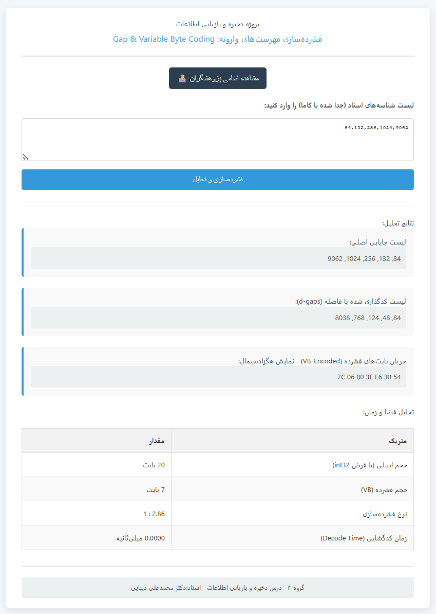

# فشرده‌سازی فهرست‌های وارونه (Inverted Index Compression)


این پروژه برای درس **ذخیره و بازیابی اطلاعات** به عنوان یک ابزار تحت وب جهت پیاده‌سازی و تحلیل تکنیک‌های فشرده‌سازی فهرست‌های وارونه توسعه داده شده است.

## 🚀 دمو زنده (Live Demo)

می‌توانید نسخه زنده و قابل استفاده این پروژه را از طریق لینک زیر مشاهده کنید:

**[https://alireza-baqeri.github.io/Information-Retrieval/](https://alireza-baqeri.github.io/Information-Retrieval/)**

*(توجه: این لینک پس از انجام مراحل گیت‌هاب و فعال‌سازی GitHub Pages کار خواهد کرد)*

## 🖼️ اسکرین‌شات



*(نکته: یک اسکرین‌شات از صفحه وب پروژه خود گرفته و با نام `screenshot.png` در این پوشه ذخیره کنید.)*

## 🎯 هدف پروژه

هدف اصلی این پروژه، پیاده‌سازی دو الگوریتم کلیدی برای فشرده‌سازی لیست‌های ارسال (Posting Lists) است:
1.  **Gap Encoding:** تبدیل لیست شناسه‌های اسناد به لیستی از تفاضل‌ها برای کاهش اندازه اعداد.
2.  **Variable Byte (VB) Coding:** فشرده‌سازی اعداد کوچک حاصل از مرحله قبل با استفاده از تعداد بایت‌های متغیر.

## ✨ ویژگی‌ها

- **رابط کاربری تعاملی:** ورود آسان لیست شناسه‌ها و مشاهده آنی نتایج.
- **تحلیل آماری:** نمایش حجم داده قبل و بعد از فشرده‌سازی و محاسبه نرخ فشرده‌سازی.
- **نمایش گام به گام:** مشاهده خروجی هر مرحله (Gap List و VB Stream).
- **تحلیل کارایی زمانی:** اندازه‌گیری و نمایش زمان لازم برای فشرده‌سازی و بازگشایی.
- **کدنویسی سمت کاربر:** تمام محاسبات با استفاده از JavaScript در مرورگر کاربر انجام می‌شود.

## 🛠️ تکنولوژی‌های استفاده شده

- **HTML5**
- **CSS3**
- **JavaScript (ES6+)**

## 📂 نحوه اجرای پروژه به صورت محلی

1.  ریپازیتوری را کلون کنید:
    ```bash
    git clone [https://github.com/alireza-baqeri/Information-Retrieval.git](https://github.com/alireza-baqeri/Information-Retrieval.git)
    ```
2.  به پوشه پروژه بروید:
    ```bash
    cd Information-Retrieval
    ```
3.  فایل `index.html` را در مرورگر خود باز کنید.

## 📄 لایسنس

این پروژه تحت لایسنس **MIT** منتشر شده است. برای اطلاعات بیشتر فایل `LICENSE` را مطالعه کنید.

## 👨‍🏫 تقدیر و تشکر

- **استاد راهنما:** جناب آقای دکتر محمدعلی دیبایی
- **پژوهشگران (گروه ۳):**
    - علیرضا باقری (سرگروه)
    - آرش غواصی
    - محمد حسین بحریان
    - علیرضا فرجامیان
    - فاطمه همتیان